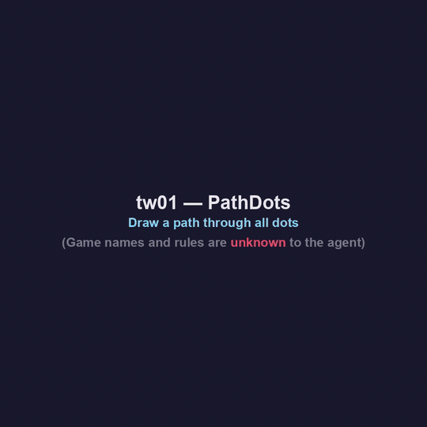
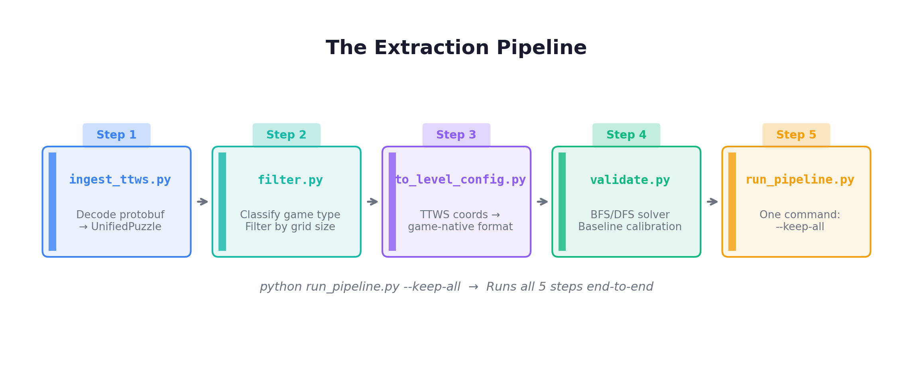
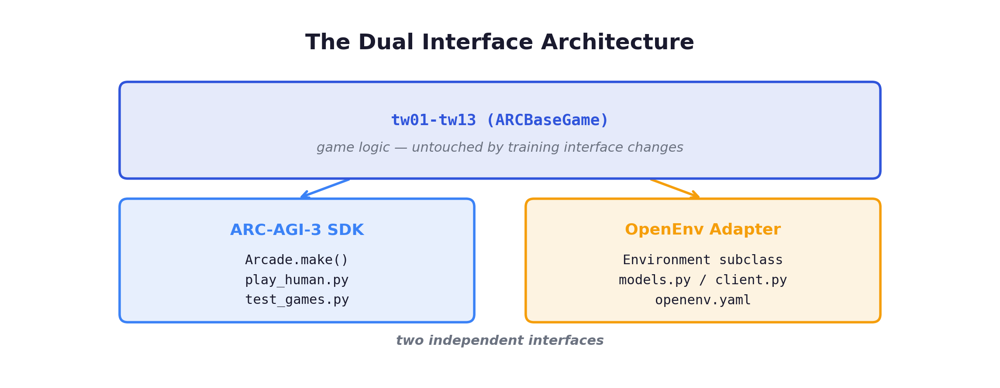
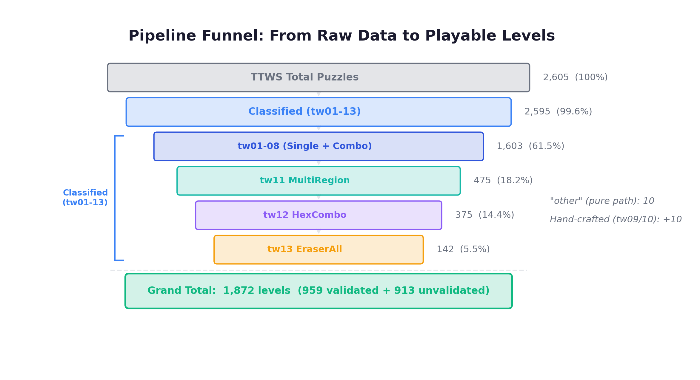
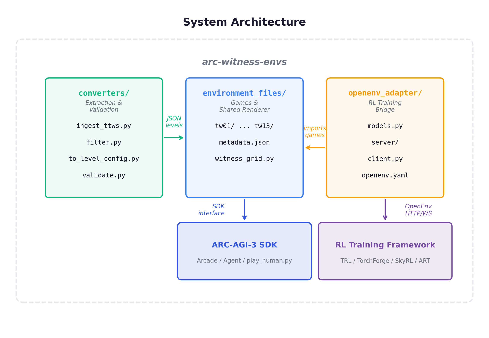
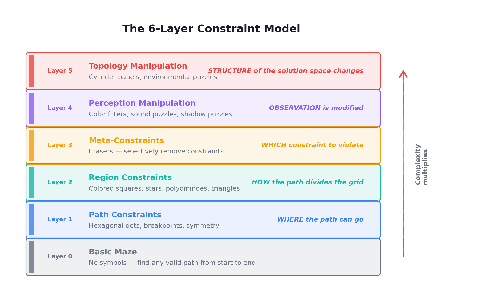

<div align="center">
  <h1>🧩 ARC-Witness-Envs</h1>
  <p><b>Witness-inspired puzzle environments for <a href="https://arcprize.org/arc-agi/3/">ARC-AGI-3</a></b><br>
  <b>13 games, 1,872 levels of interactive reasoning challenges</b></p>
</div>

<p align="center">
  <a href="https://opensource.org/licenses/MIT"></a>
  <a href="https://www.python.org/"></a>
  <a href="https://arcprize.org/arc-agi/3/"></a>
  <a href="https://github.com/meta-pytorch/OpenEnv"></a>
  <a href="https://colab.research.google.com/github/Guanghan/arc-witness-envs/blob/main/examples/quickstart.ipynb"></a>
  <a href="https://huggingface.co/spaces/Guanghan-Ning/arc-witness-envs-demo"></a>
  <br>
  <a href="https://www.kaggle.com/datasets/guanghanning/arc-witness-envs"></a>
  <a href="https://www.kaggle.com/code/guanghanning/arc-witness-envs-warm-up-gym-for-arc-agi-3"></a>
</p>

<p align="center">
  
</p>

<p align="center">
  Built on the official <a href="https://docs.arcprize.org">ARC-AGI SDK</a> &bull;
  <a href="https://blog.guanghan.ai/post/260312_arc_witness_env/"><b>Blog Post</b></a>
</p>

## 📰 News

- **[2026/3/17]** We release **v0.2.0** — teaching data collection mode! Play games in the browser while annotating your reasoning at each step. Collected episodes are saved as structured JSON for fine-tuning agents. ([details](#teaching-data-collection))
- **[2026/3/12]** We release **v0.1.0** — initial release with **13 games** and **1,872 levels** (959 solver-verified). Drop-in compatible with the [ARC-AGI-3 SDK](https://docs.arcprize.org) and [OpenEnv](https://github.com/meta-pytorch/OpenEnv) for RL training.

---

### Highlights
- **Drop-in compatible** with any ARC-AGI-3 agent — just point at `environment_files/`
- **RL-ready** via [OpenEnv](https://github.com/meta-pytorch/OpenEnv) adapter with 3 reward modes
- **64x64 pixel grid** with 16-color palette, 5 discrete actions
- **959 solver-verified levels** with baseline scores; 913 additional unvalidated levels
- **Progressive difficulty** — each game teaches abstract rules through increasingly harder puzzles, no text instructions
- **Teaching mode** — annotate reasoning while playing to build training data for agents

## 📝 Contents

- **Usage**
  - [Quick Start](#quick-start)
  - [OpenEnv Adapter (RL Training)](#openenv-adapter)
  - [ARC-AGI-3 Integration](#arc-agi-3-integration)
  - [Teaching Data Collection](#teaching-data-collection)
- **Reference**
  - [Games](#games)
  - [Architecture & Project Structure](#architecture)
  - [Why The Witness?](#why-the-witness)

<a id="quick-start"></a>

## 🚀 Quick Start

### Install

```bash
pip install arc-agi
```

### Play in Browser

Try it instantly: **[Live Demo](https://huggingface.co/spaces/Guanghan-Ning/arc-witness-envs-demo)** — no installation needed.

Or run locally:

```bash
cd arc-witness-envs
python play_human.py
# Open http://localhost:8001
```

### Use Programmatically

Try it directly in **[Google Colab](https://colab.research.google.com/github/Guanghan/arc-witness-envs/blob/main/examples/quickstart.ipynb)**, or run locally:

```python
from arcengine import GameAction, ActionInput
from environment_files.tw01.tw01 import Tw01

game = Tw01(seed=0)

UP, DOWN, LEFT, RIGHT, CONFIRM = (
    GameAction.ACTION1, GameAction.ACTION2,
    GameAction.ACTION3, GameAction.ACTION4,
    GameAction.ACTION5,
)

# Play level 1: navigate to collect all dots, then confirm
for action in [RIGHT, RIGHT, UP, LEFT, LEFT, UP, RIGHT, RIGHT, CONFIRM]:
    frame = game.perform_action(ActionInput(id=action), raw=True)

print(f"Levels completed: {frame.levels_completed}")
print(f"State: {frame.state}")  # GameState.PLAYING or GameState.WIN
```

<details>
<summary><strong>Run Tests & Re-extract Levels</strong></summary>

#### Run Tests

```bash
python test_games.py
# 13/13 games, 959 validated levels verified (913 unvalidated skipped)
```

#### Re-extract Levels

```bash
cd converters
python run_pipeline.py --keep-all
```

<p align="center">
  
</p>

</details>

<a id="openenv-adapter"></a>

## 🔧 OpenEnv Adapter (RL Training)

The `openenv_adapter/` module wraps all 13 games as [OpenEnv](https://github.com/meta-pytorch/OpenEnv) environments for RL training, while the game implementations remain fully ARC-AGI-3 SDK compatible.

<p align="center">
  
</p>

### Design

- **Episode = one level**: `reset()` starts (or restarts) the current level; the episode ends when the level is solved or truncated
- **Observation**: 64x64 int grid (color indices 0-15) + level metadata
- **Action**: discrete 1-5 (UP / DOWN / LEFT / RIGHT / CONFIRM)
- **Truncation**: `max_steps = baseline x 3`

#### Compatible RL Training Frameworks

Because arc-witness-envs implements the [OpenEnv](https://github.com/meta-pytorch/OpenEnv) protocol (HTTP/FastAPI + Gymnasium-style `reset()`/`step()` API), it integrates with the growing ecosystem of RL frameworks that support OpenEnv:

| Framework | OpenEnv Support | RL Algorithms | Notes |
|-----------|----------------|---------------|-------|
| [**TRL**](https://huggingface.co/docs/trl/main/en/openenv) (HuggingFace) | Official | GRPO | `GRPOTrainer` with custom `rollout_func`; vLLM inference |
| [**TorchForge**](https://github.com/meta-pytorch/torchforge) (Meta) | Native | GRPO, PPO | Direct plug-in, no adapter needed; scales to 512 GPUs |
| [**SkyRL**](https://docs.skyrl.ai/docs) | Official | GRPO, PPO, DAPO | SkyRL-Gym `BaseTextEnv` interface; Megatron 5D parallelism |
| [**ART**](https://art.openpipe.ai/integrations/openenv-integration) (OpenPipe) | Official | GRPO | Automatic — any OpenEnv environment works out of the box |
| [**VeRL**](https://github.com/volcengine/verl) (ByteDance) | Planned | PPO, GRPO | Gym-style agent loop is architecturally compatible; explicit integration underway |
| [**Oumi**](https://github.com/oumi-ai/oumi) | Via TRL | GRPO | Uses TRL's `GRPOTrainer` under the hood |

> **Note on observation space**: These frameworks are primarily designed for LLM-based agents (text in, text out). For arc-witness-envs' **64x64 int grid** observations, you'll likely need a vision encoder (simple CNN) or a multimodal model. The OpenEnv adapter handles the environment side — the model architecture is up to you.

<details>
<summary><strong>Reward Modes</strong> (<code>reward_mode</code> / <code>WITNESS_REWARD</code>)</summary>

| Mode | Solve | Step | Wrong CONFIRM | Best for |
|------|-------|------|---------------|----------|
| `sparse` | +1.0 | 0 | 0 | Exploration-heavy algorithms (RND, ICM) |
| `shaped` (default) | +1.0 | -0.01 | -0.1 | PPO, SAC — solve always net positive |
| `arc_score` | min(baseline/steps, 1) | 0 | -0.1 | Directly mirrors ARC-AGI-3 scoring |

Key property: **solving a level is always a positive reward signal**, regardless of how many steps it took.

</details>

<details>
<summary><strong>Algorithm-Reward Pairing Guide</strong></summary>

| Algorithm | Recommended Reward Mode | Why |
|-----------|------------------------|-----|
| PPO / APPO | `shaped` | Step penalty encourages efficiency; solve is always net positive |
| DQN | `shaped` | Natural fit for discrete 5-action space |
| GRPO | `arc_score` | Directly mirrors ARC-AGI-3 scoring for outcome-based RL |
| RND / ICM | `sparse` | Pure exploration signal; intrinsic motivation handles the rest |
| SAC | `shaped` | With discretized action space |

</details>

### Install

```bash
pip install arc-agi openenv
```

### Start Server

```bash
cd arc-witness-envs

# Serve tw01 (default)
uvicorn openenv_adapter.server.app:app --host 0.0.0.0 --port 8000

# Serve a specific game with specific reward mode
WITNESS_GAME=tw03 WITNESS_REWARD=arc_score uvicorn openenv_adapter.server.app:app --port 8000
```

### Use Client

```python
import asyncio
from openenv_adapter.client import WitnessEnvClient
from openenv_adapter.models import WitnessAction, WitnessGameAction

async def main():
    client = WitnessEnvClient(base_url="ws://localhost:8000")
    async with client:
        result = await client.reset()
        print(f"Level: {result.observation.level_index}")

        for action in [WitnessGameAction.RIGHT, WitnessGameAction.UP, WitnessGameAction.CONFIRM]:
            result = await client.step(WitnessAction(action=action))
            print(f"Reward: {result.reward}, Done: {result.done}")

asyncio.run(main())
```

### Use Directly (No Server)

```python
from openenv_adapter.server.witness_environment import WitnessEnvironment
from openenv_adapter.models import WitnessAction, WitnessGameAction

env = WitnessEnvironment(game_id="tw01", seed=0)
obs = env.reset()

obs = env.step(WitnessAction(action=WitnessGameAction.RIGHT))
print(f"Reward: {obs.reward}, Done: {obs.done}")
print(f"Frame shape: {len(obs.frame)}x{len(obs.frame[0])}")  # 64x64
```

<a id="arc-agi-3-integration"></a>

## 🎯 ARC-AGI-3 Integration

This repository provides **training environments** for the [ARC-AGI-3 competition](https://arcprize.org/arc-agi/3/) — the first Interactive Reasoning Benchmark (IRB). Agents must:

1. **Explore** — discover game rules through interaction (no instructions provided)
2. **Learn** — infer abstract constraints from visual feedback
3. **Plan** — solve increasingly difficult levels within an action budget

Scoring: `score = max(0, 1 - actions_taken / baseline_actions)` per level, averaged across all levels.

### Use with Your ARC-AGI-3 Agent

Point your agent at this repo's `environment_files/` directory — no code changes needed:

```python
from arc_agi import Arcade, OperationMode

arcade = Arcade(
    operation_mode=OperationMode.OFFLINE,
    environments_dir="path/to/arc-witness-envs/environment_files",
)

# Your agent sees tw01-tw13 exactly like official ARC-AGI-3 games
for env_info in arcade.get_environments():
    print(env_info.game_id, env_info.title)

scorecard_id = arcade.create_scorecard(tags=["witness"])
env = arcade.make(game_id="tw03", scorecard_id=scorecard_id)
obs = env.reset()

# ... run your agent as usual ...
```

Or serve them via the SDK's REST API for remote agents:

```python
arcade = Arcade(
    operation_mode=OperationMode.OFFLINE,
    environments_dir="path/to/arc-witness-envs/environment_files",
)
arcade.listen_and_serve(port=8001)
# Your agent connects to http://localhost:8001/api/cmd/ACTION1 etc.
```

<a id="teaching-data-collection"></a>

## 📋 Teaching Data Collection

Toggle **Teaching Mode** in the browser UI (`play_human.py`) to annotate your reasoning while solving puzzles. Each action can be paired with a free-text explanation of *why* you chose it.

On level completion, a dialog prompts for:
- **Key insights** discovered during the level
- **Rules discovered** about the game mechanics
- **Difficulty rating** (1-5)

Episodes are saved as structured JSON in `teaching_data/`, ready for fine-tuning agents via SFT or building reward models.

<a id="games"></a>

## 🎮 Games

| Game | Mechanic | Levels | Core Knowledge |
|------|----------|--------|----------------|
| `tw01` PathDots | Mandatory waypoints | 16 | Objectness |
| `tw02` ColorSplit | Region color partition | 62 | Objectness + Numbers |
| `tw03` ShapeFill | Polyomino exact cover | 248 | Geometry |
| `tw04` SymDraw | Mirrored line drawing | 26 | Geometry (symmetry) |
| `tw05` StarPair | Region pair counting | 55 | Numbers |
| `tw06` TriCount | Edge counting | 144 | Numbers |
| `tw07` EraserLogic | Error absorption | 502 | Meta-reasoning |
| `tw08` ComboBasic | Squares + Stars | 108 | Composition |
| `tw09` CylinderWrap | Horizontal wrap | 5 | Topology |
| `tw10` ColorFilter | Perception transform | 5 | Perception |
| `tw11` MultiRegion | 2+ region constraints | 410 | Composition |
| `tw12` HexCombo | Dots + region rules | 160 | Composition |
| `tw13` EraserAll | Generalized erasers | 131 | Meta-reasoning |

<details>
<summary><strong>Game Details</strong> (click to expand)</summary>

### tw01 — PathDots
Draw a path from start to end that passes through **all** marked waypoints (yellow dots).
- 16 levels (10 validated + 6 unvalidated), progressively harder
- Advanced levels include breakpoints (blocked edges) and multiple start points
- Trains: path planning, constraint satisfaction

### tw02 — ColorSplit
Draw a path that **partitions** the grid into regions where each region contains only one color of square.
- 62 levels (51 validated + 11 unvalidated, up to 3 colors)
- Advanced levels include breakpoints (blocked edges)
- Trains: classification, spatial reasoning, region analysis

### tw03 — ShapeFill
Draw a path that partitions the grid; each region's polyomino pieces must **exactly tile** the region.
- 248 levels (106 validated + 142 unvalidated)
- NP-complete tiling validation, advanced levels include breakpoints
- Trains: spatial composition, geometric reasoning

### tw04 — SymDraw
Control a **blue** line; a **yellow** line mirrors your moves automatically. Both must reach their respective endpoints simultaneously.
- 26 levels (20 validated + 6 unvalidated)
- Symmetry types: horizontal, vertical, 180° rotational
- Advanced levels include breakpoints affecting both paths
- Trains: symmetry transforms, dual-state mental simulation

### tw05 — StarPair
Draw a path that partitions the grid; each region must contain **exactly 2 stars** of each color present.
- 55 levels (46 validated + 9 unvalidated)
- Advanced levels include breakpoints
- Trains: counting, classification, region analysis

### tw06 — TriCount
Each cell with N triangles requires the path to touch **exactly N edges** of that cell.
- 144 levels (126 validated + 18 unvalidated)
- Advanced levels include breakpoints
- Trains: local counting, edge-cell relationship reasoning

### tw07 — EraserLogic
Eraser symbols absorb constraint violations. Each region must have `#erasers == #violations`.
- 502 levels (376 validated + 126 unvalidated) — largest game
- Combines with squares, stars, and triangle constraints; advanced levels include breakpoints
- Trains: meta-reasoning, error balancing

### tw08 — ComboBasic
Simultaneous **ColorSplit** (squares) + **StarPair** (stars) constraints.
- 108 levels (61 validated + 47 unvalidated)
- Advanced levels include breakpoints
- Trains: compositional reasoning, multi-constraint satisfaction

### tw09 — CylinderWrap
PathDots variant where the grid **wraps horizontally** (left edge = right edge).
- 5 hand-crafted levels
- Trains: topological reasoning, wrap-around navigation

### tw10 — ColorFilter
ColorSplit variant where **filter cells** change the perceived color of squares. Constraints apply to perceived colors.
- 5 hand-crafted levels
- Trains: perception transformation, transform-then-apply reasoning

### tw11 — MultiRegion
Draw a path that partitions the grid; each region must satisfy **2 or more** constraint types simultaneously (e.g., squares + triangles, stars + tetris).
- 410 levels (145 validated + 265 unvalidated)
- AND logic: all present constraints must hold per region
- Constraint combinations: sq+tri, sq+tetris, star+tri, star+tetris, tri+tetris, and 3+ combos
- Trains: compositional reasoning, multi-constraint satisfaction

### tw12 — HexCombo
Draw a path through **all hex waypoints** (mandatory dots) that also partitions the grid into valid regions where all present constraints must hold simultaneously.
- 160 levels (4 validated + 156 unvalidated)
- Combines path constraint (hex dots) with region constraints (squares, stars, triangles, tetris)
- Low validation rate due to BFS complexity with dot-tracking + region validation at 3s timeout
- Trains: path planning + region reasoning, dual-objective optimization

### tw13 — EraserAll
Generalization of tw07 EraserLogic — erasers absorb constraint violations from squares, stars, triangles, and tetris. Hex dots remain a hard constraint (all must be visited).
- 131 levels (61 validated + 70 unvalidated)
- Extends tw07 to support tetris violations (failed exact cover)
- Per region: `#erasers == #violations` across all absorbable constraint types
- Trains: meta-reasoning, generalized error balancing

</details>

<details>
<summary><strong>Dataset Statistics</strong> (click to expand)</summary>

**1,872 levels** across 13 games — 959 solver-verified with baseline scores, 913 additional unvalidated levels playable with auto-validation on solve.

<p align="center">
  
</p>

| Game | Mechanism | TTWS Classified | Validated | Unvalidated | **Total** | Coverage |
|------|-----------|----------------|-----------|-------------|-----------|----------|
| tw01 | PathDots | 44 | 10 | 6 | **16** | 36.4% |
| tw02 | ColorSplit | 76 | 46 | 16 | **62** | 81.6% |
| tw03 | ShapeFill | 272 | 88 | 160 | **248** | 91.2% |
| tw04 | SymDraw | 210 | 20 | 6 | **26** | 12.4% |
| tw05 | StarPair | 88 | 42 | 13 | **55** | 62.5% |
| tw06 | TriCount | 160 | 118 | 26 | **144** | 90.0% |
| tw07 | EraserLogic | 625 | 359 | 143 | **502** | 80.3% |
| tw08 | ComboBasic | 128 | 56 | 52 | **108** | 84.4% |
| tw09 | CylinderWrap | 0 | 5 | 0 | **5** | hand-crafted |
| tw10 | ColorFilter | 0 | 5 | 0 | **5** | hand-crafted |
| tw11 | MultiRegion | 475 | 145 | 265 | **410** | 86.3% |
| tw12 | HexCombo | 375 | 4 | 156 | **160** | 42.7% |
| tw13 | EraserAll | 142 | 61 | 70 | **131** | 92.3% |
| **Total** | | **2,605** | **959** | **913** | **1,872** | |

> **Validated** levels have solver-verified solutions with action sequences and baseline scores.
> **Unvalidated** levels passed filtering but the solver timed out (NP-hard puzzles). They are playable and marked with an orange "?" indicator. When a human solves one in `play_human.py`, it is automatically marked as validated.

</details>

<a id="architecture"></a>

## 🏗️ Architecture & Project Structure

<p align="center">
  
</p>

All games inherit from `ARCBaseGame` and follow the SDK contract. Rendering flows through a shared `WitnessGrid` that produces 64x64 int grids with 16-color palette indices.

<details>
<summary><strong>Architecture details</strong> (click to expand)</summary>

#### ARCBaseGame Contract

```
ARCBaseGame
├── __init__()    → create Level objects with Sprites
├── on_set_level() → initialize game state for current level
├── step()        → process one GameAction, update display
└── next_level()  → advance on correct solution
```

#### WitnessGrid Renderer

```
WitnessGrid(cols, rows)
├── render_grid()           → 64x64 int[][] (color indices)
├── draw_path_segment()     → render path between nodes
├── draw_dot() / draw_start() / draw_end()
├── draw_cell_symbol()      → colored squares in cell centers
├── draw_star()             → diamond-shaped star symbols
├── draw_triangle()         → 1-3 small triangles per cell
├── draw_polyomino()        → tetris piece preview
├── draw_eraser()           → Y-shaped eraser symbol
├── draw_breakpoint()       → gap on blocked edge between nodes
├── draw_unvalidated_indicator() → orange "?" for unverified levels
├── path_splits_regions()   → BFS region extraction
└── cell_edge_count()       → count path edges touching a cell
```

#### Coordinate System

- **Nodes**: `(col, row)` in `[0, cols] x [0, rows]` — path intersections
- **Cells**: `(col, row)` in `[0, cols-1] x [0, rows-1]` — spaces between nodes
- **Pixels**: 64x64 grid, nodes rendered as 1px dots, edges as 1px lines

#### Action Space

| Action | ID | GameAction |
|--------|-----|------------|
| Up | 1 | `ACTION1` |
| Down | 2 | `ACTION2` |
| Left | 3 | `ACTION3` |
| Right | 4 | `ACTION4` |
| Confirm | 5 | `ACTION5` |

</details>

<details>
<summary><strong>Directory layout</strong> (click to expand)</summary>

```
arc-witness-envs/
├── assets/                   # README images
│   └── icon.png
├── witness_grid.py            # Shared grid renderer (64x64, 16-color)
├── test_games.py              # Automated test suite (959 validated levels)
├── play_human.py              # Local web server for browser play
├── environment_files/         # Game code + metadata (SDK-compatible layout)
│   ├── tw01/
│   │   ├── tw01.py            # PathDots game (ARCBaseGame subclass)
│   │   └── metadata.json
│   ├── tw02/ ... tw13/        # Same structure for each game
├── levels/                    # Level configs with verified solutions
│   ├── tw01_levels.json       # 16 levels (10v + 6u)
│   ├── ...                    # tw02-tw13
│   └── tw13_levels.json       # 131 levels (61v + 70u)
├── openenv_adapter/           # OpenEnv RL training adapter
│   ├── models.py              # Action/Observation Pydantic models
│   ├── client.py              # WebSocket client (EnvClient subclass)
│   ├── openenv.yaml           # OpenEnv manifest
│   └── server/
│       ├── witness_environment.py  # Environment wrapper (ARCBaseGame → OpenEnv)
│       └── app.py             # FastAPI entry point
├── teaching/                  # Teaching data collection module
│   ├── models.py              # TeachingStep, EpisodeOutcome models
│   └── collector.py           # Episode recording & JSON persistence
└── converters/                # Puzzle extraction pipeline
    ├── unified_puzzle.py      # Intermediate data model + classifier
    ├── ingest_ttws.py         # Decode protobuf puzzles from ttws
    ├── filter.py              # Classify & filter by game type + grid size
    ├── to_level_config.py     # Convert to game-native level configs
    ├── validate.py            # BFS/DFS solver + baseline calibration
    ├── run_pipeline.py        # One-command extraction pipeline
    └── vendor_ttws/           # Community puzzle data (barrycohen/ttws, MIT)
```

</details>

<a id="why-the-witness"></a>

## 💡 Why The Witness?

[The Witness](https://en.wikipedia.org/wiki/The_Witness_(2016_video_game)) contains 523+ hand-crafted line-drawing puzzles that teach abstract rules through progressive difficulty — no text, no tutorials. Each puzzle type maps cleanly to ARC-AGI [Core Knowledge](https://arxiv.org/abs/1911.01547) priors:

<p align="center">
  
</p>

<details>
<summary><strong>Puzzle mechanic to Core Knowledge mapping</strong> (click to expand)</summary>

| Puzzle Mechanic | Core Knowledge | Game |
|---|---|---|
| Hexagon dots (mandatory waypoints) | Objectness — preserving specific elements | `tw01` |
| Colored squares (region partition) | Objectness + Numbers — classify by attribute | `tw02` |
| Polyomino shapes (exact cover tiling) | Geometry — spatial composition | `tw03` |
| Symmetry (mirrored line drawing) | Geometry — symmetry transforms, mental simulation | `tw04` |
| Stars (region pair counting) | Numbers — counting + classification | `tw05` |
| Triangles (edge counting) | Numbers — local counting constraints | `tw06` |
| Erasers (error absorption) | Meta-reasoning — constraint violation balancing | `tw07` |
| Squares + Stars (dual constraint) | Composition — multiple simultaneous rules | `tw08` |
| Cylinder wrap (topology) | Topology — non-planar space | `tw09` |
| Color filters (perception transform) | Perception — transform-then-apply | `tw10` |
| Multi-constraint regions | Composition — 2+ simultaneous region constraints | `tw11` |
| Hex dots + region constraints | Composition — path waypoints + region rules | `tw12` |
| Erasers + multi-constraint | Meta-reasoning — generalized error absorption | `tw13` |

</details>

## 📖 Citation

```bibtex
@software{ning2026arcwitness,
  author = {Ning, Guanghan},
  title  = {arc-witness-envs: Witness-Inspired Puzzle Environments for ARC-AGI-3},
  year   = {2026},
  url    = {https://github.com/Guanghan/arc-witness-envs},
}
```

## 🙏 Acknowledgements

- [**The Witness**](https://en.wikipedia.org/wiki/The_Witness_(2016_video_game)) by Jonathan Blow / Thekla, Inc. — the brilliant puzzle design that inspired every game mechanic in this project.
- [**barrycohen/ttws**](https://github.com/barrycohen/ttws) — community-built open-source reimplementation of The Witness puzzles, whose protobuf puzzle data made large-scale level extraction possible.
- The Witness fan community — for collectively creating and curating thousands of puzzles that form the raw dataset behind these environments.

## 🤝 Contributing

Contributions welcome — new games, level packs, bug fixes, documentation improvements. Please open an issue before submitting large PRs so we can discuss the approach.

## ⚖️ License

[MIT](https://opensource.org/licenses/MIT). The vendored puzzle data in `converters/vendor_ttws/` is from [barrycohen/ttws](https://github.com/barrycohen/ttws) under the same MIT license.

